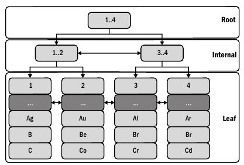
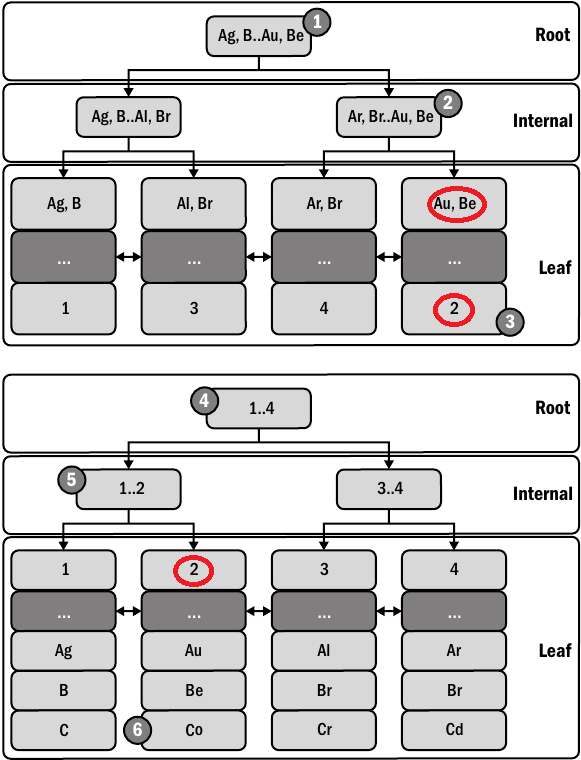

# 2. 인덱스와 인덱싱
- 
### 2.1 성능 향상과 관련 없는 딴짓
- MySql 성능 향상을 위해 '고사양의 하드웨어를 구매하는 것'과 'MysSQL 튜닝'이라는 레드헤어링 등장
##### 더 좋고 빠른 하드웨어!
- 스케일업은 최후의 보루
- 스케일업부터하면 아무것도 배우지 못하고 문제 대강 넘기는데 익숙해짐
##### MySQL 튜닝
- 아래 용어
  - 튜닝: 연구개발 목적으로 MySQL 시스템 변수를 조정
  - 구성: 시스템 변수를 하드웨어와 환경에 적합한 값으로 설정하는 행위
  - 최적화: 워크로드를 줄이거나 효율성을 높여 MySQL 성능을 향상시키는 행위
- MySQL 튜닝은 두가지 이유로 레드헤어링 
  - 실험 했을 때처럼 수행되지 않을때가 많아 결과가 의심
  - MySQL은 이미 고도로 최적화 됨
- 독창적 MySQL 재구성도 무 의미하게 MySQL에서 자동으로 해줌
- 튜닝은 레드헤링이고 구성은 MySQL에서 자동으로 이루어지므로 최적화만 신경쓰면 됨

### 2.2 MySQL 인덱스: 시각적 소개
- 쿼리와 인덱스를 변경하는 방법으로 다양한 성능 문제가 해결
##### InnoDB 테이블은 인덱스다
- 프라이머리 키(이하 PK) 조회는 매우 빠르고 효율적
- InnoDB는 B-트리 인덱스 활용 -> 탐색 시간 복잡도 O(logN) 

- 세컨더리 인덱스도 결국 PK를 찾아 조회

##### 테이블 접근 방법
- 인덱스를 사용하여 행 조회 방법은 세가지 테이블 접근 방법 중 하나 -> 인덱스 조회가 가장 적합하면서 일반적임
- 인덱스 조회가 불가능 할때는 '인덱스 스캔' 또는 '테이블 스캔' 접근 방법 유일
- 인덱스 조회
  - 대량의 데이터를 대상으로 한 빠르고 효율적인 접근 -> 인덱스 도입 목적
  - 직접 쿼리 최적화의 본질
- 인덱스 스캔
  - 
- 테이블 스캔