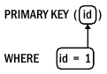

# 2. 인덱스와 인덱싱
- 
### 2.1 성능 향상과 관련 없는 딴짓
- MySql 성능 향상을 위해 '고사양의 하드웨어를 구매하는 것'과 'MysSQL 튜닝'이라는 레드헤어링 등장
##### 더 좋고 빠른 하드웨어!
- 스케일업은 최후의 보루
- 스케일업부터하면 아무것도 배우지 못하고 문제 대강 넘기는데 익숙해짐
##### MySQL 튜닝
- 아래 용어
  - 튜닝: 연구개발 목적으로 MySQL 시스템 변수를 조정
  - 구성: 시스템 변수를 하드웨어와 환경에 적합한 값으로 설정하는 행위
  - 최적화: 워크로드를 줄이거나 효율성을 높여 MySQL 성능을 향상시키는 행위
- MySQL 튜닝은 두가지 이유로 레드헤어링 
  - 실험 했을 때처럼 수행되지 않을때가 많아 결과가 의심
  - MySQL은 이미 고도로 최적화 됨
- 독창적 MySQL 재구성도 무 의미하게 MySQL에서 자동으로 해줌
- 튜닝은 레드헤링이고 구성은 MySQL에서 자동으로 이루어지므로 최적화만 신경쓰면 됨

### 2.2 MySQL 인덱스: 시각적 소개
- 쿼리와 인덱스를 변경하는 방법으로 다양한 성능 문제가 해결
##### InnoDB 테이블은 인덱스다
- 프라이머리 키(이하 PK) 조회는 매우 빠르고 효율적
- InnoDB는 B-트리 인덱스 활용 -> 탐색 시간 복잡도 O(logN)<br>

- 세컨더리 인덱스도 결국 PK를 찾아 조회


##### 테이블 접근 방법
- 인덱스를 사용하여 행 조회 방법은 세가지 테이블 접근 방법 중 하나 -> 인덱스 조회가 가장 적합하면서 일반적임
- 인덱스 조회가 불가능 할때는 '인덱스 스캔' 또는 '테이블 스캔' 접근 방법 유일
- 인덱스 조회
  - 대량의 데이터를 대상으로 한 빠르고 효율적인 접근 -> 인덱스 도입 목적
  - 직접 쿼리 최적화의 본질
- 인덱스 스캔
  - 모든 행을 읽고 필터링, 프라이머리 키로 모든 행을 읽기 전 세컨더리 인덱스로 행을 읽음
  - 인덱스 스캔에는 두가지 유형 존재
    - 풀 인덱스 풀 스캔
      - 인덱스 순서가 ORDER BY 쿼리와 일치할 때 행정렬 피할 수 있음(SELECT * FROM elem FORCE INDEX(a) ORDER BY a,b)
      - 세컨더리 인덱스를 읽고 프라이머리 키로 해당 행 조회
    - 인덱스 전용 스캔
      - 인덱스에서 열값(행 x)을 읽기 때문에 인덱스 커버링 필요
- 테이블 스캔
  - 프라이머리 키 순서로 모든 행을 읽음
  - 일반적으로 테이블 스캔을 피하는게 좋지만 허용 또는 나은 경우 존재
    - 테이블이 작고 접근 빈도가 낮을 때
    - 테이블 선택도가 매우 낮을 때
##### 맨 왼쪽 접두사(leftmost prefix) 요구사항
- 인덱스 정의에서 지정한 맨 왼쪽 인덱스 열로 시작하는 하나 이상의 인덱스 열을 반드시 사용
- 맨 왼쪽 접두사에 대한 요구사항은 두가지 논리적인 결과를 가져옴
  - 인덱스 (a,b)와 (b,a)는 서로 다름 -> 인덱스가 (a,b) 형식으로 설정되어 있다면, where b='Be' and a='Au'로 검색시 인덱스 사용 불가
  - 인덱스 (a)와 (a,b) 대신 (a,b,c) 사용 가능성 큼 -> (a)와 (a,b)는 (a,b,c)의 맨 왼쪽 접두사이기 때문(둘은 중복되기에 삭제될 수 있음)
- 모든 세컨더리 인덱스 끝에는 PK가 존재 -> 자동 설정때문에 (a,b,id) 같이 임의로 PK 굳이 포함할 필요는 없음
- 인덱스가 클수록 많은 메모리 필요 -> 프라이머리 키의 크기를 작게 유지, 세컨더리 인덱스 수를 적절히 유지

##### EXPLAIN: 쿼리 실행 계획
- 쿼리 실행 계획에는 테이블 조인순서, 테이블 접근 방법, 인덱스 사용 등 중요 정보 포함
- 쿼리에서 단일 문자를 변경하면 실행계획이 크게 변경됨
  - where id = 1과 where id > 1은 다름
- 전문가도 실행 계획 출력 형식을 읽어야 추세와 진보에 보조를 맞출 수 있음 -> 기본 형식으로 그대로 유지되고 있음
````
  EXPLAIN SELECT * FROM elem WHERE id=1
*************************************************************  
  id:1
  select_type: SIMPLE
  table: elem
  partitions: NULL
  type: const
  possible_keys: PRIMARY
  key: PRIMARY
  key_len: 4
  ref: const
  rows: 1
  filtered: 100.00
  Extra: NULL
````
- 7개 필드
  - table: 테이블 이름이나 참조된 서브 쿼리, 조인 순서대로 출력
  - type: 테이블 접근이나 인덱스 조회의 접근 유형, ALL 풀 테이블 스캔 의미
  - possible_keys: 쿼리가 맨 왼쪽 접두사를 사용하므로 MySQL 사용할 수 있는 인덱스 나열
  - key: MySQL이 사용할 인덱스의 이름이거나 인덱스를 사용할 수 없을때는 NULL
  - ref: 인덱스(key 필드)에서 행을 조회하는 데 사용되는 값의 소스를 나열
  - rows: 행을 찾기 위해 조회할 예상 행의 수, 실제 값과 근사하지만 같지는 않음
  - Extra: 쿼리 실행 계획에 대한 부가 정보, 적용할 수 있는 쿼리 최적화를 나타냄
##### WHERE 
- 인덱스를 사용하여 WHERE 절의 테이블 조건과 일치하는 행을 찾을 수 있음<br>

  - 굵은 선의 사각형은 테이블 조건과 인덱스 열을 사용할 수 있음을 나타냄
  - 화살표는 테이블 조건에서 출발해 사용하는 인덱스 열을 가리킴
````
  EXPLAIN SELECT * FROM elem WHERE id=1
*************************************************************  
  id:1
  select_type: SIMPLE
  table: elem
  partitions: NULL
  type: const
  possible_keys: PRIMARY
  key: PRIMARY
  key_len: 4
  ref: const
  rows: 1
  filtered: 100.00
  Extra: NULL
````
- 설명
  - key: Primary는 인덱스 조회로 프라이머리 키를 사용할 것임을 확인
  - 접근 유형(type)은 ALL 또는 index가 아니라 간단한 프라이머리 키 조회로 예상
  - const 접근 유형은 프라이머리 키나 유니크 세컨더리 인덱스의 모든 인덱스 열에 상수 조건(ref: const) 있을때만 발생
### 2.3 인덱싱: MySQL처럼 생각하는 방법
### 2.4 좋은 인덱스였는데....
### 2.5 테이블 조인 알고리즘