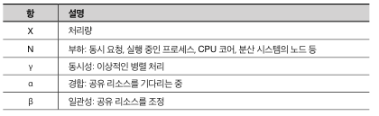

# 4. 접근 패턴
- 애플리케이션이 MySQL을 사용하여 데이터에 접근하는 방법
- 쿼리, 인덱스, 데이터 최적화 다음에  접근 패턴을 최적화
- MySQL은 애플리케이션에 대해 충분히 빠름 -> 애플리케이션이 MySQL을 효율적으로 사용하느냐고 중요
### 4.1 MySQL은 아무것도 하지 않는다
- 애플리케이션 상태에 따라 MySQL도 영향을 받음
  - 애플리케이션이 유후(idle) 상태면 MySQL도 유후 상태임
- MySQL이 느리게 실행된다면, 외부 문제가 없으면 원인은 애플리케이션
- MySQL은 애플리케이션이 사용자 모르게 쿼리를 실행하지 않는 이상 고스트 미존재
- 쿼리 경합(로우락)은 MySQL이 바쁜것처럼 보이게 할 수 있음 -> MySQL은 애플리케이션 쿼리만 실행할 뿐
### 4.2 한계에 도달하면  성능이 불안정해진다
- 선형 스케일링은 모든 DBA와 엔지니어의 이상 -> 실현될 수가 없음 

  - 선형 스케일링(선형 확장): 시스템 용량을 100% 사용할 때까지 증가한 다음, 성능 일정하게 유지
  - 데이터베이스 성능은 시스템 용량의 100% 미만의 한계까지만 부하 증가 -> 현실적으로 80% ~ 95%
  - 부하가 한도를 증가하면 성능 불안정 -> 성능 저하 및 최악의 경우 운영 중단
- 범용 확장성 법칙 -> 실제 MySQL 성능을 놀라울 정도로 잘 모델링함 

  - 동시성과 부하가 증가함에 따라 처리량 증가
  - 경합과 일관성은 처리량 감소
- 한계를 밀어붙일 때 실제 중단에서 발생한 3개의 차트 

##### 상승기(오전 6시 ~ 9시)
- 메트릭이 꾸준히 상승
- 개발자들은 트래픽 처리를 위해 트랜잭션 처리량을 늘림 -> MySQL 한계에 다다름 및 더이상 작동하지 않음
##### 한계점(오전 9시 ~ 정오)
- 애플리케이션 한계점이 유지되는 동안 불안정한 상태
- 스레드의 톱날 패턴은 MySQL이 불안정해졌음을 나타내는 신호 -> 하나의 쿼리 실행은 하나의 스레드
- 변함 없이 높은 CPU 사용량과 QPS는 오해 소지 존재 -> 약간의 변동 있는 것이 좋음
  - 오케스트라가 올바르게 연주되면 다양한 측면에서 변화 -> 평평한 선을 그리는 메트릭은 매우 강하게 연주하는 클라리넷 연주자
- MySQL은 CPU의 5%를 사용하지 못하고, QPS가 증가히자 않으며 실행중인 스레드가 안정화되지 않음
##### 수정(정오 ~ 오후 3시)
- 수정 사항은 트랜잭션 처리량을 줄이는 것 -> cpu 50% 감소 QPS와 실행 중인 스레드 안정적인 변동 폭
  - 고속도로가 막히는데 해소하려면? 자동차의 수를 줄이는 것 -> 더 적은 자동차가 더 빨리 달릴수 있음
- 높은 부하는 애플리케이션을 불안정하게 하여 MySQL에서 부하가 증가하는 것을 방지 -> 쓰로틀링
- 한계에 도달한 MySQL 성능에 대한 2가지 추가 사항
  - 일부러 부족한 하드웨어를 사용하지 않는 한 한계에 도달하기 어려움
    - 애플리케이션이 모든 하드웨어를 동시에 활용하는 것은 어려움 -> 병목 현상 발생이 더 현실적임
  - 높은 부하로 인해 MySQL이 느리게 응답한다고 해서 한계에 도달했다는 의미는 아님
    - 
### 4.3 도요타와 페라리
### 4.4 데이터 접근 패턴
### 4.5 애플리케이션 변경
### 4.6 더 좋고 빠른 하드웨어?