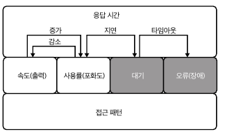

# 6. 서버메트릭
- 메트릭의 목적은 시스템이 어떻게 작동하는지 측정하고 보고 -> MySQL 메트릭도 성능과 밀접 관련
- 메트릭을 하나만 분리해서 생각하지 말고 전체적으로 확인해서 분석해야함
- MySQL 메트릭이 방대하고 체계적이지 않으므로 매우 유용하지만, 효과적으로 배우려면 집중과 조직화가 필요
## 6.1 쿼리 성능 대 서버 성능
- MySQL 성능에는 `쿼리 성능`과 `서버 성능`이라는 2가지 측면 존재
  - 5장에서는 워크로드를 최적화하여 쿼리 성능을 다룸
##### 동시성과 경합
- `동시성`은 쿼리 성능을 떨어뜨리는 `경합`으로 이어짐
  - 단독으로 실행되는 쿼리는 다른 쿼리와 함께 실행될 때, 다른 성능을 냄
  - 범용 확장성 법칙에서 경합은 나누는 수에 있으며, 부하 증가에 따라 처리량이 감소함을 의미함 -> 동시성과 경합은 피할 수 없음
- 서버 성능 분석은 모든 쿼리가(동시성) 공유되고, 시스템 리소스(경합)을 놓고 경쟁할때 워크로드를 처리하는 방식을 확인하는데 유용
  - 특정 워크로드는 경합이 거의 없는데, 다른 워크로드는 쿼리와 서버 성능을 떨어뜨림
- 서버 성능을 분석하면 워크로드의 쿼리가 함께 작동하는 정보를 알수 있음
##### 튜닝
- 서버 성능에는 전적으로 워크로드 때문은 아님
  - MySQL, 운영체제, 하드웨어 등 3가지 추가 요소 존재
- 쿼리 성능에서는 3가지 요소가 워크로드에 적합하게 구성되어 있다고 가정함
  - 3가지 요소의 결함은 워크로드 보다 훨씬 적은 영향을 미침
- MySQL은 튜닝이 필요 없음 -> 효과 미미
- 그러나 튜닝을 해야한다면 알려진 안정적인 워크로드로 서버 성능을 분석해야함 
  - 그렇지 않으면 성능 향상이 튜닝의 결과라고 확신할 수 없음
##### 성능 회귀
- 일반적으로 쿼리 성능, MySQL 튜닝, 하드웨어 결함이 아니면 최후 수단으로 성능 회귀(또는 버그)를 의심함
- 다른 분들이 이러한 성능 저하를 밝히고자 성능 분석하는 좋은 예가 있음 -> 여러 레퍼런스로 인해 버그 확인은 쉽게 확인 가능
## 6.2 정상과 안정
##### 정상
- 모든 것이 제대로 작동하는 평상 시 애플리케이션에 대해 MySQL이 보이는 모든 성능
  - 성능의 일부 측면이 평소보다 더 높거나 낮은지, 더 빠르거나 느린지 등을 결정하는 기준선
- `Threads_running`이 50 미만이면 정상
  - 현재 CPU 코어가 48개 미만이고, MySQL 성능이 실행 중인 64개 스레드 이상으로 확장하지 않는다면 안정적인 값은 50 미만
  - 애플리케이션에서 60개 스레드 실행이 정상이고 안정적이라면 이는 엄청난 성능
##### 안정
- 더 나은 성능을 추구하는 과정에서 안정적인 성능을 놓쳐서는 안됨
  - MySQL에서 최대 성능을 짜내는 것이 목표가 아닌 안정적인게 중요
  - 한계에서 성능이 불안정해지면 성능보다 더 큰 문제 발생
- 안전성은 성능을 제한하는 것이 아닌 모든 수준에서 지속 가능한 성능을 보장
## 6.3 핵심 성능 지표
##### 응답 시간
- 모두가 관심을 두는 유일한 지표 -> 응답시간이 빠르더라도 KPI도 함께 고려해야함
  - 응답시간이 빠르더라도 모든 쿼리가 오류율 100%면 의미 없음
- 정상이고 안정적이면서 응답시간이 낮을수록 좋음
##### 오류
- 오류의 비율 -> 쿼리 오류뿐만 아니라 쿼리, 연결, 클라이언트, 서버와 같은 모든 유로
- 정상이고 안정적인 오류울이 목표이며, 0에 가까울수록 좋음
##### QPS
- QPS는 성능을 나타내지만 그 자체가 성능은 아님
  - 비정상적으로 높은 QPS는 문제일수 있음
- 정상이고 안정적인 QPS이며 목푯값은 그때마다 다름
##### 실행 중인 스레드
- MySQL이 QPS를 달성하기 위해 얼마나 노력하는지를 측정
- 하나의 스레드는 하나의 쿼리를 실행하기에, QPS와 스레드는 밀접하여 같이 고려해야함
- 정상이고 안정적인 스레드 실행, 즉 낮을수록 좋음

- 4가지 메트릭이 MySQL의 핵심 성능 지표임 -> 항상 모니터링 필요
## 6.4 메트릭 필드
- 메트릭 필드 -> 모든 메트릭은 6개의 클래스 가운데 하나에 속함 

- 하나의 메트릭이 아닌 다양한 메트릭을 통해 분석 필요
##### 응답 시간 메트릭
- MySQL이 응답하는 데 걸리는 시간을 나타냄
- 하위 수준의 세부사항을 포함하므로 메트릭 필드에서 최상위 수준
- 쿼리 응답 시간은 가장 중요하고 일반적으로 모니터링되는 유일한 지표
- MySQL은 단계별 명령문을 실행하고 시간을 지정할 수 있음
  - UPDATE문은 15단계 중 1단계에 불과함, 실제 쿼리 실행은 여러 단계 중 하나
  - 단계별 응답 시간은 MySQL 전문가가 서버 성능 문제를 심층 조사하는데 사용됨
- 응답 시간 메트릭은 중요하지만 완전히 불투명함
##### 속도 메트릭
- MySQL이 개별 작업을 얼마나 빨리 완료하였는 지를 나타냄
  - QPS는 보편적인 데이터베이스의 속도 메트릭
- 속도가 증가하면 관련 사용률을 높일 수 있음
- 속도와 사용률의 관계는 다른 변경 사항을 가정하지 않음
  - 사용률이나 사용률에 영향을 미치는 속도를 변경할 때에만 사용률을 높이지 않고 속도를 높일수 있음
  - 속도가 관계의 원인이므로 사용률보다 속도를 변경하는 것은 쉬움
##### 사용률 메트릭
- MySQL이 유한한 리소스를 얼마나 많이 사용하는지를 나타냄
  - CPU 사용량, 메모리 사용량, 디스크 사용량 등 -> 컴퓨터는 유한한 기계임
- 제한 속도를 사용률오 표현할 수 있음
  - 속도는 최대 속도가 있을 때 제한됨
- 사용률이 높아지면 관련 속도가 낮아질 수 있음
  - 악성 쿼리는 디스크 I/O 사용률을 100%를 만들고 QPS는 급격히 떨어짐
  - 사용률이 방성직에 나누는 수의 있는 경합과 일관성을 높임
- 사용률이 100%에 가까워지면? MySQL은 대기함
  - 그림을 보면 쿼리 실행이 대기했다가 재시작하므로 화살표가 `지연`으로 되어 있음
- 지연은 불안정하지만 2가지 이유로 피할 수 있음(`책에는 없으므로 되어 있는데 오타로 보임`)
  - 부하를 줄이거나 하드웨어 용량을 늘려 개선할 수 있음 
  - 해결하기 어렵지만 불가능하지 않음
    - 회전 디스크(HDD)를 사용하는 경우라면 NVMe로 업그레이드
##### 대기 메트릭
- 쿼리 실행 중 유후 시간을 나타냄
  - 경합과 일관성으로 쿼리 실행이 지연되는 대기가 발생
- 대기 메트릭은 속도나 응답 시간(메트릭에 따라 다름)으로 계산하지만, MySQL이 작동하지 않을 때를 나타내므로 별도로 분류할 가치가 있음
  - 성능과 상반됨
  - 그림에서 어둡게 표시한 이유는 작동하지 않기 때문
- 대기를 피할 수 없음 -> 목표는 대기를 없애는게 아니고 줄이는 것
- MySQL이 너무 오래기다리면 대기-오류 관계인 시간 초과가 발생
- 타임 아웃 관련 시스템 변수는 존재 -> 설정을 사용하되 의존해서는 안됨
  - `lock_wait_timeout` 기본값은 365일 -> 애플리케이션 코드 레벨에서 시간 초과를 사용하여 방지
##### 오류 메트릭
- 오류를 나타냄
  - 대기 시간 초과는 오류의 한 유형
- 비정상적인 오류는 좋지 않음
##### 접근 패턴 메트릭
- 애플리케이션이 어떻게 MySQL을 사용하는지를 나타냄
  - SQL문의 각 유형(`Com_select`, `Com_insert` 등)에 대한 메트릭 존재
- 접근 패턴 메트릭은 더 높은 수준의 메트릭 아래에 있음
  - `Com_select`은 실행된 `SELECT`문의 수를 계산함 -> 속도(QPS) 또는 사용률(%)을 나타낼 수 있음
##### 내부 메트릭
- 해당 책에서는 다루지 않음 -> MySQL을 더 자세히 알고 싶을때를 대비해 충분히 알면 됨
## 6.5 스펙트라
##### 쿼리 응답 시간
##### 오류
##### 쿼리
##### 읽기/쓰기
##### 관리
##### SHOW
##### 스레드와 연결
##### 임시 개체
##### 준비된 명령어
##### 잘못된 SELECT
##### 복제
##### 데이터 크기
## 6.6 모니터링과 경보

